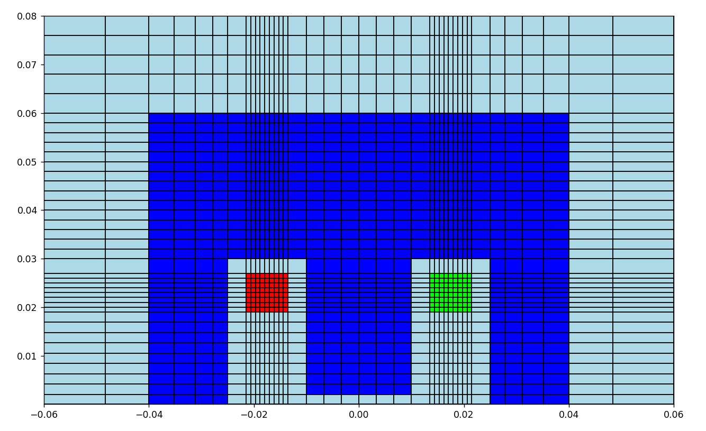

# Практическая работа по дисциплине "Метод конечных элементов"

### Решение линейных и нелинейных задач магнитостатики. Построение интерполяционных и сглаживающих сплайнов.

## Цель работы

Разработать программу решения линейной и нелинейной задачи магнитостатики методом конечных элементов с использованием билинейных базисных функций на прямоугольниках.

## Внешний вид сетки

## Примеры решений линейной и нелинейной задач

